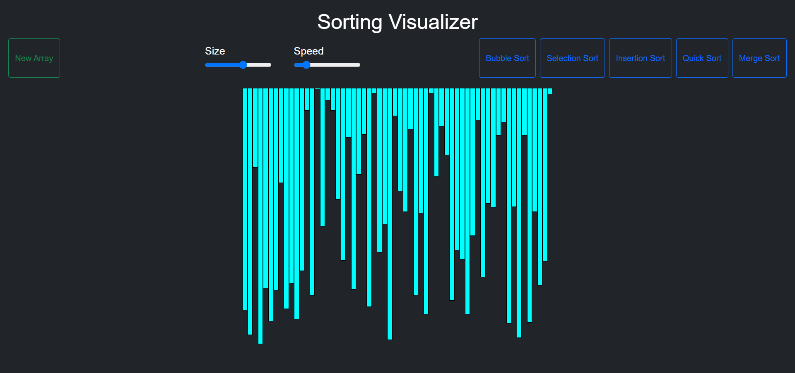
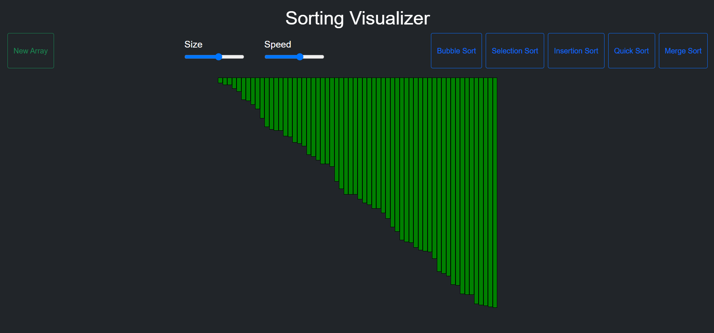

### Sorting Visualizer is a web app for visualizing a bunch of different sorting algorithms Like Selection Sort, Bubble Sort, Insertion Sort, Merge Sort, Quick Sort, Heap Sort With the functionality of (Speed Control) and (Array Size Control).

# `Sorting Visualization`
### This is a simple visualization project made using javascript 
- `Bubble Sort` 
- `Selection Sort`
- `Insertion Sort`
- `Quick Sort`
- `Merge Sort`

### This is built using `HTML`, `CSS`, `JavaScript`  

[Check out the website here](https://github.com/GkY273303/sorting-visualization/)

  
  
  
